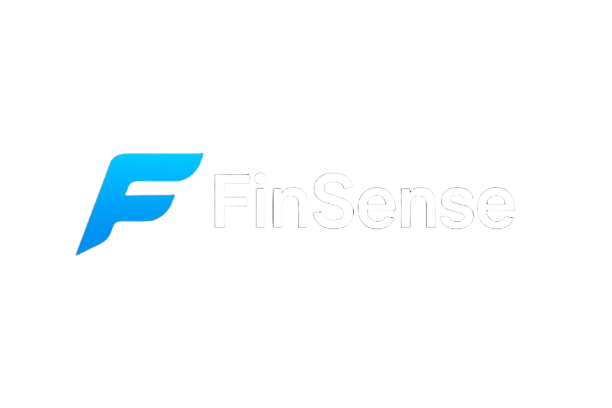
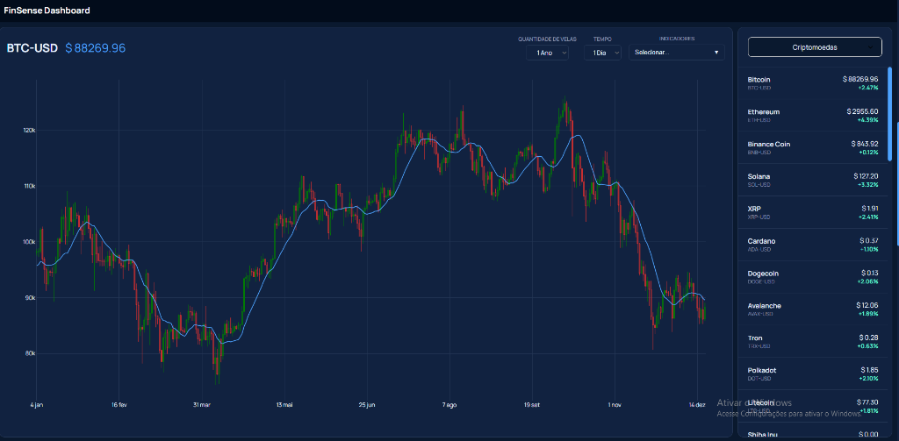
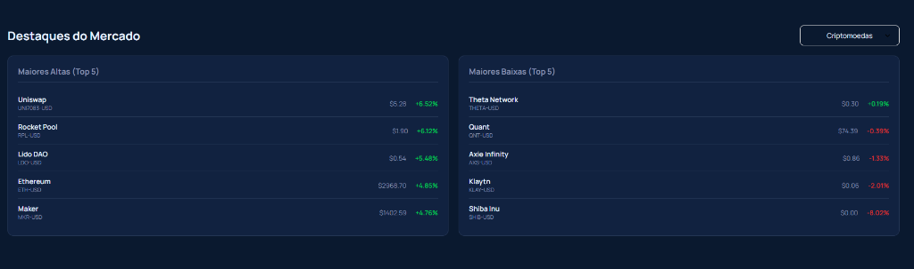

  

> **Access the project here / Acesse o projeto aqui:** [https://finsense-5xn5.onrender.com](https://finsense-5xn5.onrender.com)

---

## 🇺🇸 English Summary

**FinSense** is a unified platform for tracking and analyzing financial assets (Brazilian Stocks, US Stocks, and Cryptocurrencies). It helps you manage your portfolio and stay updated with the global market.

### Key Features:

- **Market Dashboard**: Real-time overview of global indices (S&P 500, Ibovespa, Bitcoin), top market movers, and a sector heatmap.
- **Portfolio Manager**: Track your investments, view historical evolution (Invested vs. Current Value vs. Benchmark), and analyze asset allocation.
- **Risk & Correlation**: Advanced tools to verify portfolio diversification and asset correlation.

---

### 🚧 PROJETO EM CONSTRUÇÃO 🚧

Este projeto foi desenvolvido estritamente para **fins didáticos e de aprendizado** em programação e finanças.
**NÃO É UMA RECOMENDAÇÃO DE INVESTIMENTO.** O uso das informações aqui contidas é de total responsabilidade do usuário.

---

## ☁️ Hospedagem no Render.com

Este projeto está hospedado na plataforma **Render**.

> ⚠️ **Atenção:** Como estamos utilizando o plano gratuito, a aplicação pode entrar em modo de "suspenção" (sleep) após períodos de inatividade.
> **O primeiro acesso pode levar cerca de 1 a 2 minutos para carregar**, pois o servidor precisa "acordar". Por favor, aguarde o carregamento.

---

## 🧩 Partes do Projeto

O FinSense é uma plataforma unificada para acompanhamento e análise de ativos financeiros (Ações Brasil, EUA e Criptomoedas).

### 1. Dashboard de Mercado (`Início`)

Visão geral do mercado financeiro em tempo real.

- **Destaques**: Mostra os principais índices globais (Ibovespa, S&P 500, Bitcoin).
- **Market Movers**: Lista das maiores altas e baixas do dia.
- **Heatmap**: Mapa de calor visual para identificar rapidamente setores em alta ou baixa.

  

  

  

### 2. Gerenciador de Portfólio (`Minha Carteira`)

Ferramenta para controle pessoal de investimentos.

- **Registro**: Adicione suas compras de ativos com data e preço.
- **Evolução Patrimonial**: Gráfico comparativo que mostra:
  - 🔵 **Valor Atual**: Quanto vale sua carteira hoje.
  - 🟢 **Total Investido**: Quanto dinheiro você efetivamente aportou.
  - 🟠 **Benchmark**: Comparativo (ex: "E se eu tivesse comprado Ibovespa/CDI?").
- **Alocação**: Gráfico de pizza mostrando a divisão da carteira (Ações BR, EUA, Cripto).

  

### 3. Análise de Correlação & Risco

Ferramenta avançada para entender a diversificação.

- **Matriz de Correlação**: Calcula como seus ativos se comportam uns em relação aos outros.
- Ajuda a identificar se sua carteira está diversificada ou se todos os ativos sobem/caem juntos.

  

---

### 🛠️ Tecnologias

- **Backend**: Python (Flask), YFinance (Dados de Mercado), BCB (Dados do Banco Central).
- **Frontend**: HTML5, CSS3, JavaScript (Plotly.js para gráficos).
