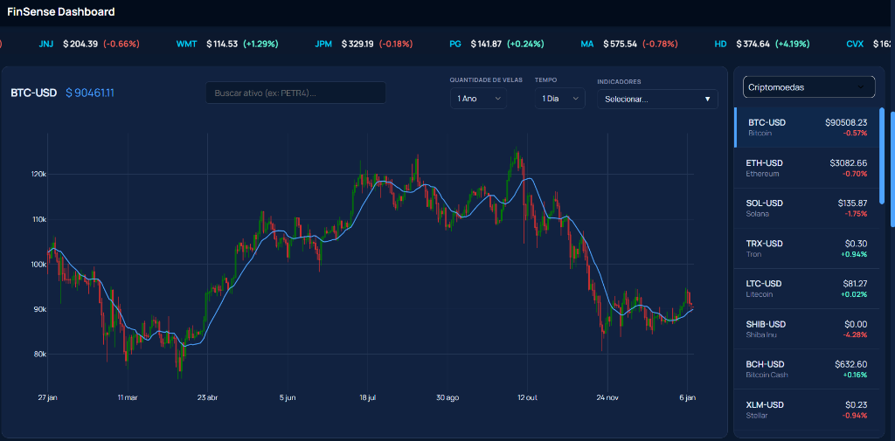
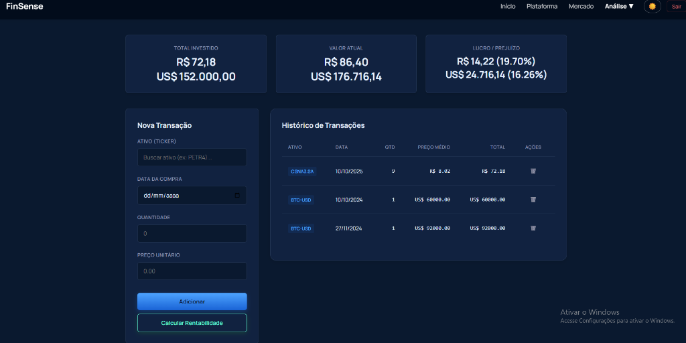
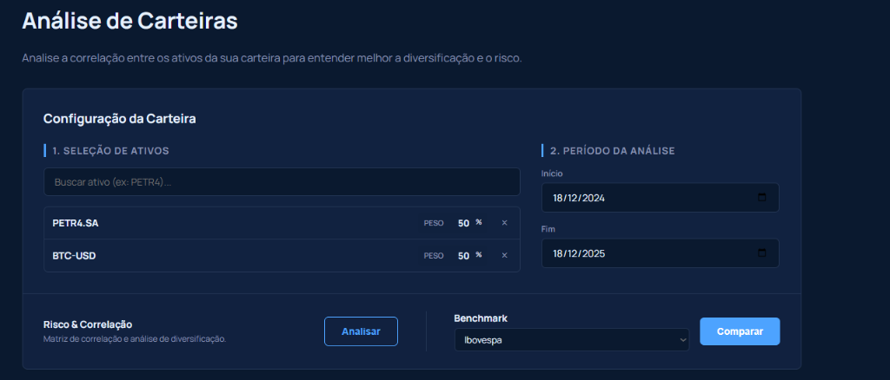
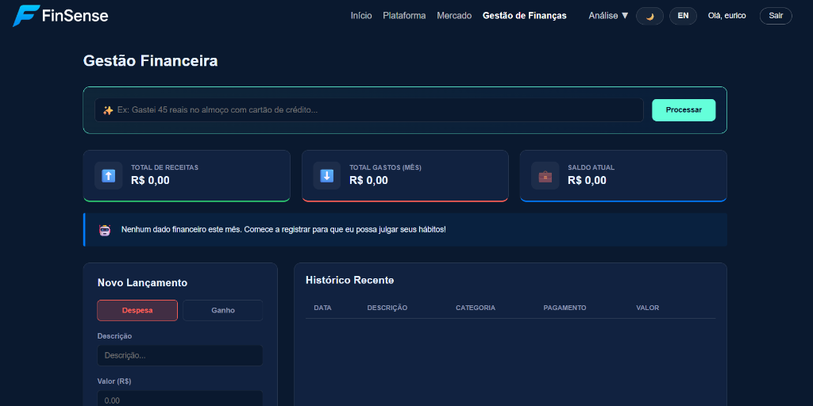
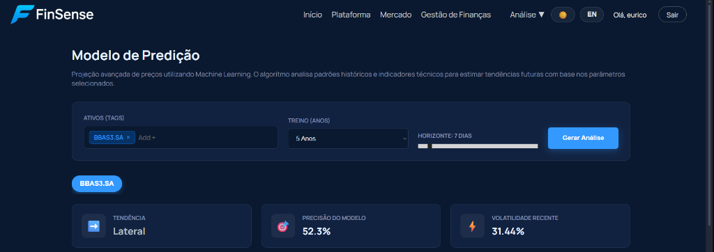
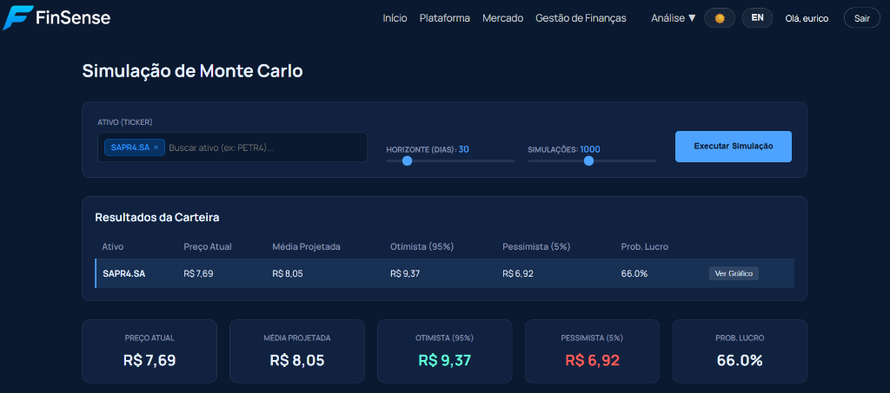

<p align="center">
  
</p>

---

## 🇺🇸 English Summary

**FinSense** is a unified platform for tracking and analyzing financial assets (Brazilian Stocks, US Stocks, and Cryptocurrencies). It helps you manage your portfolio and stay updated with the global market.

### Key Features:

- **Market Dashboard**: Real-time overview of global indices (S&P 500, Ibovespa, Bitcoin), top market movers, and a sector heatmap.
- **Portfolio Manager**: Track your investments, view historical evolution (Invested vs. Current Value vs. Benchmark), and analyze asset allocation.
- **Risk & Correlation**: Advanced tools to verify portfolio diversification and asset correlation.



---

### 🚧 PROJETO EM CONSTRUÇÃO 🚧

Este projeto foi desenvolvido estritamente para **fins didáticos e de aprendizado** em programação e finanças.
**NÃO É UMA RECOMENDAÇÃO DE INVESTIMENTO.** O uso das informações aqui contidas é de total responsabilidade do usuário.

---

### 🧩 Partes do Projeto

O FinSense é uma plataforma unificada para acompanhamento e análise de ativos financeiros (Ações Brasil, EUA e Criptomoedas).

### 1. Dashboard de Mercado (`Início`)

Visão geral do mercado financeiro em tempo real.

- **Destaques**: Mostra os principais índices globais (Ibovespa, S&P 500, Bitcoin).
- **Market Movers**: Lista das maiores altas e baixas do dia.
- **Heatmap**: Mapa de calor visual para identificar rapidamente setores em alta ou baixa.

<p align="center">
  
</p>
<p align="center">
  
</p>
<p align="center">
  
</p>

### 2. Gerenciador de Portfólio (`Minha Carteira`)

Ferramenta para controle pessoal de investimentos.

- **Registro**: Adicione suas compras de ativos com data e preço.
- **Evolução Patrimonial**: Gráfico comparativo que mostra Valor Atual vs Total Investido vs Benchmark.
- **Alocação**: Gráfico de pizza mostrando a divisão da carteira (Ações BR, EUA, Cripto).

<p align="center">
  
</p>

### 3. Análise de Correlação & Risco

Ferramenta avançada para entender a diversificação.

- **Matriz de Correlação**: Calcula como seus ativos se comportam uns em relação aos outros.

<p align="center">
  
</p>

### 4. Controle Financeiro (`Finanças`) 🆕

Módulo completo para gestão de despesas pessoais com auxílio de IA.

- **Entrada Inteligente (IA)**: Adicione despesas usando linguagem natural (ex: "Gastei 50 reais no uber hoje").
- **Dashboard de Despesas**: Acompanhe seus gastos por categoria e evolução mensal.
- **Metas de Orçamento**: Defina e monitore limites de gastos.

<p align="center">
  
</p>

### 5. Predição de Mercado (`Predição`) 🆕

Modelos de Machine Learning para auxiliar na tomada de decisão.

- **Random Forest**: Previsão de preço de fechamento.
- **Regressão Logística**: Probabilidade direcional (Alta/Baixa).
- **Indicador de Confluência**: Sinal unificado quando ambos os modelos concordam.

<p align="center">
  
</p>
<p align="center">
  
</p>

### 6. Simulação de Monte Carlo (`Simulação`) 🆕

Projeção estocástica de cenários futuros para sua carteira.

- **Cenários**: Visualize milhares de possíveis caminhos para seus investimentos.
- **VaR (Value at Risk)**: Estime a perda máxima provável em diferentes níveis de confiança.

<p align="center">
  
</p>
<p align="center">
  
</p>

### 7. Otimização de Portfólio (`Otimização`) 🆕

Ferramenta baseada na Teoria Moderna de Portfólio (Markowitz).

- **Fronteira Eficiente**: Encontre a melhor relação risco x retorno.
- **Pesos Ideais**: Sugestão de rebalanceamento para maximizar o Sharpe Ratio.

---

### 📂 Estrutura do Projeto

A organização das pastas segue o padrão Flask:

- **`templates/`**: Contém todos os arquivos HTML (páginas do site).
  - _Ex: `index2.html`, `login.html`, `portfolio.html`._
- **`static/`**: Arquivos estáticos (CSS, JS, Imagens).
  - **`assets/`**: Imagens do projeto (logos, previews).
  - **`css/`**: Estilos (ex: `dashboard.css`).
  - **`js/`**: Scripts interativos (ex: `dashboard.js`).
- **`app.py`**: O "cérebro" da aplicação. Arquivo principal Python que roda o servidor Flask e gerencia as rotas e API.

### 🚀 Como Rodar

Para visualizar o projeto corretamente com todas as funcionalidades, siga os passos abaixo:

#### 1. Pré-requisitos

Certifique-se de ter o [Python](https://www.python.org/downloads/) instalado (versão 3.8 ou superior).

#### 2. Instalação e Ambiente Virtual

É altamente recomendável criar um ambiente virtual para evitar conflitos. No terminal da pasta do projeto:

**Windows:**

```powershell
# Cria o ambiente
python -m venv .venv

# Ativa o ambiente
.\.venv\Scripts\activate

# Instala as dependências
pip install -r requirements.txt
```

**Linux / Mac:**

```bash
python3 -m venv .venv
source .venv/bin/activate
pip install -r requirements.txt
```

#### 3. Executando

Após instalar as dependências, execute o comando:

```bash
python app.py
```

1. O terminal mostrará um link (geralmente `http://127.0.0.1:5000` ou `http://localhost:5000`).
2. **Segure Ctrl e clique no link** (ou copie e cole no navegador) para acessar.
3. Crie uma conta na tela de Login (o banco de dados será criado automaticamente).

> **Nota:** Se utilizar o Live Server, certifique-se de abrir a pasta raiz do projeto no VS Code para que os caminhos dos arquivos funcionem corretamente.

---

### 🛠️ Tecnologias e Ferramentas

- **Backend**: Python (Flask), YFinance, BCB.
- **Data Science/AI**: Scikit-learn, Numpy, Pandas, Scipy.
- **Frontend**: HTML5, CSS3, JavaScript (Plotly.js, Particles.js).

#### 🧩 Extensões Recomendadas (VS Code)

Ao abrir o projeto no VS Code, você deve receber uma recomendação automática para instalar as seguintes extensões (arquivo `.vscode/extensions.json`):

- **Python** & **Pylance**: Suporte essencial para o código Python.
- **Prettier**: Para formatar HTML/CSS/JS automaticamente.
- **Jupyter**: Caso queira rodar análises em notebooks.
- **Code Runner**: Para executar trechos de código rapidamente.
